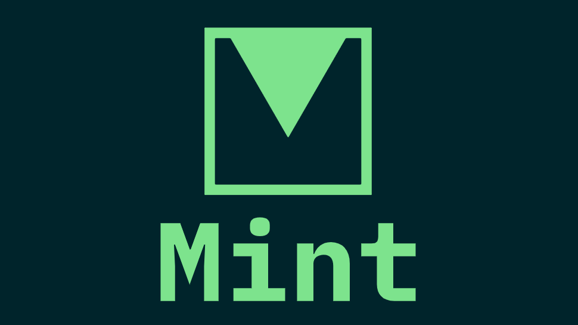

    

 

# 💎 Mint Stack 💎

Mint stack provides a complete starter kit for backend/frontend stacks.

### Backend Stacks:

1. [Node/Express, MongoDB](https://github.com/antick/mint-express)
2. Laravel
3. Deno
4. Django
5. Flask

### Frontend Stacks

1. [React Hooks, Redux](https://github.com/antick/mint-react)
2. Vue
3. Svelte

## Note:

Mint stack is under heavy development so more details will be added here in soon.

## Author

Pankaj Sanam - [@pankajsanam](https://twitter.com/pankajsanam)
